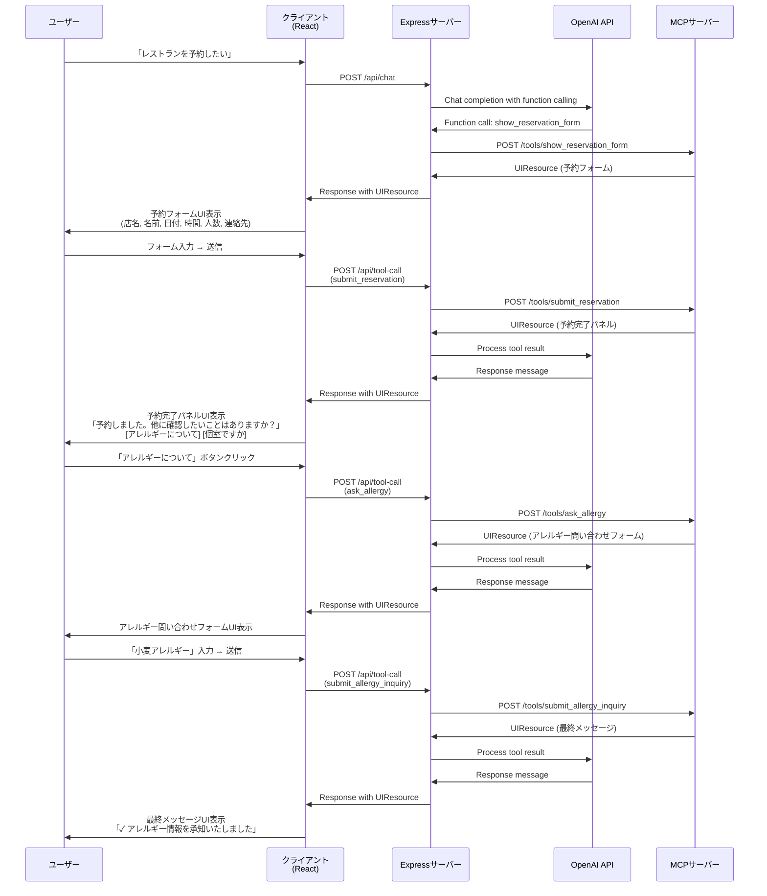

# MCP-UI Demo Project

Interactive chat demo application using Model Context Protocol (MCP) with UI extensions.

## Project Overview

This project demonstrates how to integrate MCP-UI into a chat application, allowing LLMs to display interactive forms and UI components within chat messages.

**Current Status:** Phase 4 Complete - Fully Functional Chat UI ✅

## Architecture

```
┌─────────────┐
│   User      │
└──────┬──────┘
       │
       ▼
┌─────────────────────────┐
│   Chat UI (React)       │  Port: 5173
│  - Vite dev server      │
└──────┬──────────────────┘
       │
       ▼
┌─────────────────────────┐
│  Express Server         │  Port: 3000
│  - API endpoints        │
│  - OpenAI integration   │
└──────┬──────────────────┘
       │
       ▼
┌─────────────────────────┐
│  MCP Server             │  Port: 3001
│  - UIResource generation│
└─────────────────────────┘
```

## Prerequisites

- Node.js >= 18.0.0
- npm >= 9.0.0

## Quick Start

### 1. Install Dependencies

```bash
npm install
```

### 2. Set Up Environment Variables

```bash
cp .env.example .env
```

Edit `.env` and add your OpenAI API key:

```env
OPENAI_API_KEY=sk-your-api-key-here
```

### 3. Start Development Servers

**Option A: Start all servers at once**
```bash
npm run dev
```

**Option B: Start servers individually**

Terminal 1 - React Client:
```bash
npm run dev:client
```

Terminal 2 - Express Server:
```bash
npm run dev:server
```

Terminal 3 - MCP Server:
```bash
npm run dev:mcp
```

### 4. Access the Application

- **Client:** http://localhost:5173
- **Server API:** http://localhost:3000/api
- **Server Health:** http://localhost:3000/health
- **MCP Server:** http://localhost:3001/tools
- **MCP Health:** http://localhost:3001/health

### 5. Set Up Environment Variables

Before testing, copy `.env.example` to `.env` and add your OpenAI API key:

```bash
cp .env.example .env
```

Edit `.env` and set your OpenAI API key:
```env
OPENAI_API_KEY=sk-your-actual-api-key-here
```

### 6. Test MCP Server (Phase 2)

**List available tools:**
```bash
curl -s http://localhost:3001/tools | jq .
```

**Generate reservation form:**
```bash
curl -s -X POST http://localhost:3001/tools/show_reservation_form \
  -H 'Content-Type: application/json' \
  -d '{"restaurantName":"イタリアンレストラン"}' \
  | jq .
```

**Submit reservation:**
```bash
curl -s -X POST http://localhost:3001/tools/submit_reservation \
  -H 'Content-Type: application/json' \
  -d '{
    "name": "山田太郎",
    "date": "2025-11-15",
    "time": "19:00",
    "partySize": 4,
    "contact": "090-1234-5678",
    "restaurantName": "イタリアンレストラン"
  }' \
  | jq .
```

### 7. Test Chat API (Phase 3)

**Note:** Requires valid OpenAI API key in `.env`

**Send a chat message:**
```bash
curl -s -X POST http://localhost:3000/api/chat \
  -H 'Content-Type: application/json' \
  -d '{"message":"レストランを予約したいです"}' \
  | jq .
```

**Expected response includes UIResource for reservation form:**
```json
{
  "success": true,
  "conversationId": "conv_...",
  "message": "フォームを表示しました",
  "uiResource": {
    "type": "resource",
    "resource": {
      "uri": "ui://reservation-form/...",
      "mimeType": "text/html",
      "text": "<!DOCTYPE html>..."
    }
  }
}
```

## Project Structure

```
jsconf-mcp-ui-demo/
├── client/               # React + Vite frontend
│   ├── src/
│   │   ├── components/  # React components
│   │   ├── hooks/       # Custom hooks
│   │   ├── types/       # TypeScript types
│   │   ├── App.tsx      # Main app component
│   │   └── main.tsx     # Entry point
│   └── package.json
│
├── server/              # Express backend
│   ├── src/
│   │   ├── routes/      # API routes
│   │   ├── services/    # Business logic
│   │   ├── config/      # Configuration
│   │   └── index.ts     # Server entry point
│   └── package.json
│
├── mcp-server/          # MCP server
│   ├── src/
│   │   ├── tools/       # MCP tools
│   │   └── index.ts     # MCP server entry point
│   └── package.json
│
├── shared/              # Shared types
│   └── src/
│       └── types/       # Common TypeScript types
│
└── package.json         # Root workspace config
```

## Available Scripts

### Root Level

- `npm run dev` - Start all servers concurrently
- `npm run dev:client` - Start React client only
- `npm run dev:server` - Start Express server only
- `npm run dev:mcp` - Start MCP server only
- `npm run build` - Build all packages
- `npm run lint` - Lint all packages
- `npm run format` - Format code with Prettier
- `npm run clean` - Remove all node_modules

### Package Level

Each package (client, server, mcp-server) has its own scripts:
- `npm run dev --workspace=<package-name>`
- `npm run build --workspace=<package-name>`
- `npm run lint --workspace=<package-name>`

## Development Roadmap

### ✅ Phase 1: Project Setup
- [x] Monorepo configuration with npm workspaces
- [x] TypeScript configuration
- [x] ESLint and Prettier setup
- [x] Basic client, server, and mcp-server scaffolding
- [x] Development environment ready
- [x] MCP-UI SDK integration (@mcp-ui/client v5.14.1, @mcp-ui/server v5.13.1)

### ✅ Phase 2: MCP Server Implementation
- [x] Integrate @mcp-ui/server SDK
- [x] Implement reservation form UI generation tool
- [x] Implement submit_reservation tool
- [x] Create UIResource generators with rawHtml
- [x] REST API endpoints for tool execution
- [x] Local testing complete

### ✅ Phase 3: Express Server Implementation
- [x] OpenAI GPT-4 Turbo integration
- [x] Function calling implementation for MCP tools
- [x] MCP client for server-to-server communication
- [x] Chat API endpoints (POST /api/chat, GET/DELETE)
- [x] In-memory conversation management
- [x] ES modules migration for server package

### ✅ Phase 4: React Client Implementation (Complete)
- [x] Chat UI components (ChatUI, MessageList, MessageItem, InputArea)
- [x] UIResource renderer with iframe sandboxing
- [x] postMessage handling with origin validation
- [x] Integration with backend API
- [x] Error handling and loading states
- [x] Type-safe implementation (no 'any' types)
- [x] Security improvements (origin validation, environment-based logging)
- [x] Memory management (TTL, cleanup, limits)

### ✨ Production-Ready Features
- [x] TypeScript strict mode with full type safety
- [x] Security: postMessage origin validation
- [x] Memory management: Conversation TTL (1 hour) and auto-cleanup
- [x] Error handling: Comprehensive try-catch blocks
- [x] Environment-based logging (DEV only)
- [x] React best practices: Proper hook dependencies

## Use Cases

### 1. Restaurant Reservation Form
User requests to make a reservation → LLM displays interactive form → User fills form → Reservation submitted

### 2. Choice Selection
User asks for recommendations → LLM displays choice buttons → User selects option → Conversation continues

## レストラン予約デモの処理フロー

以下の図は、レストラン予約デモの完全な処理フローを示しています：



### 処理フローの詳細

1. **予約フォーム表示**
   - ユーザーが「レストランを予約したい」と入力
   - LLMが`show_reservation_form`関数を呼び出し
   - 予約フォームUIが表示される（店名、名前、日付、時間、人数、連絡先）

2. **予約送信と完了パネル表示**
   - ユーザーがフォームに入力して送信
   - `submit_reservation`が呼び出され、予約が処理される
   - 予約完了パネルが表示され、関連アクションボタンが表示される

3. **アレルギー問い合わせ**
   - 「アレルギーについて」ボタンをクリック
   - `ask_allergy`が呼び出され、アレルギー問い合わせフォームが表示される

4. **アレルギー情報送信と最終メッセージ**
   - 「小麦アレルギー」を入力して送信
   - `submit_allergy_inquiry`が呼び出され、最終メッセージUIが表示される

## Environment Variables

| Variable | Description | Default |
|----------|-------------|---------|
| `PORT` | Express server port | 3000 |
| `OPENAI_API_KEY` | OpenAI API key | (required) |
| `MCP_PORT` | MCP server port | 3001 |
| `MCP_SERVER_URL` | MCP server URL | http://localhost:3001 |
| `VITE_API_URL` | API URL for client | http://localhost:3000 |

## Technology Stack

- **Frontend:** React 18, TypeScript, Vite
- **Backend:** Express, TypeScript, OpenAI SDK
- **MCP:** Model Context Protocol SDK
- **Tools:** ESLint, Prettier, tsx, concurrently

## Contributing

This is a demo project for JSConf. For questions or suggestions, please open an issue.

## License

MIT

## References

- [Model Context Protocol](https://modelcontextprotocol.io/)
- [OpenAI Function Calling](https://platform.openai.com/docs/guides/function-calling)
- [React Documentation](https://react.dev/)
- [Express Documentation](https://expressjs.com/)
