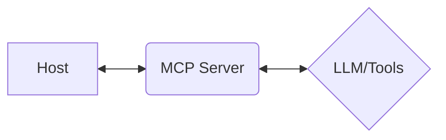

<!-- _class: lead -->

# “テキスト”から“UI”へ：AI時代のSaaSインターフェース再定義
## - MCP UIによる実現 -

<br>
<br>

**（氏名）**

**（所属）**

---

# SaaS is dead？

- **進化の圧力**
    - アウトカムへの直結
    - ワークフローへの統合
    - AIエージェントの前提化

<br>

SaaSは“死”んだのではなく、**UIの再定義**が求められている。

---

# チャット（テキストのみ）の壁

- **発見性の低さ**
  - 何ができるか見えづらい
- **検証性の弱さ**
  - 誤りや手戻りの把握がしづらい
- **複雑な作業への不適合**
  - フォーム、テーブル、可視化など、リッチなUIがないため多段・並列作業に不向き

---

# よくある疑問：HTML/画像で十分？

LLMはHTMLや画像を返すことはできます。

**しかし、それは“見た目の断片”に過ぎません。**

- 自社のデザインシステムと未接続
- 一貫したイベント処理や状態管理と未接続

<br>

結果として、プロダクト品質に繋がりにくいアドホックな対応になりがちです。

---

# MCP UIの答え

1. **“返答 = UI” の標準化**
   - LLMはUIリソースを返し、Host（クライアント）はそれを描画するだけ

2. **デザインシステム統合**
   - Remote DOMを自社のReact/Web Componentsにマッピング

3. **ユーザー操作の同期**
   - ユーザー操作とLLM/ツールの実行を標準化された経路で往復させる

---

# アーキテクチャ



**フロー:**
1. **Intent** (ユーザーの意図)
2. MCP ServerがLLM/ツールを呼び出し、**UI定義**を返却
3. HostがUIを**描画**
4. ユーザーがUIを**操作** (イベント発生)
5. MCP Serverがイベントに基づき**ツール実行**
6. UIを**継続的に更新**

---

# デザインシステム統合

- **既存コンポーネントへのマッピング**
  - 既存のボタン、フォーム、テーブルにprops/eventを通じてマッピング
- **デザインの一貫性を継承**
  - テーマ、デザイントークン、アクセシビリティをそのまま継承
- **“生成されたUI”も自社基準の品質**
  - 見た目と振る舞いが既存のUIと完全に一致

---

# ユーザー操作の同期

- **標準化されたイベント処理**
  - クリックやフォーム送信を`onUIAction`のような標準イベントで処理
- **状態更新としてのUI**
  - ツール実行結果はテキストではなく、更新されたUIとして返却される
- **一目瞭然なデータフロー**
  - `onUIAction: submit(form_data)` のようなイベントログで同期を可視化

---

# 最小例：UI定義

LLM/ツールが返すのは、このようなUI定義です。

```json
{
  "type": "form",
  "fields": [
    { "name": "date", "type": "date", "label": "日付" },
    { "name": "time", "type": "time", "label": "時間" },
    { "name": "party_size", "type": "number", "label": "人数" }
  ],
  "actions": [
    { "type": "submit", "label": "予約検索" }
  ]
}
```

Host側はこれを自社のデザインシステムで描画し、
送信後の状態遷移も再びUI定義として受け取ります。

---

# ライブデモ（概略）：レストラン予約

1. **「レストランを予約したい」**
   - → 予約フォームUIが表示
     (店名, 日付, 時間, 人数, 名前, 電話)

2. **フォーム入力 → 送信**
   - → UIが更新され、次のステップへ

3. **予約完了パネル**
   - 「予約しました。他に確認したいことはありますか？」
   - → 関連アクションのボタンUIが表示
     `[アレルギーについて]`, `[個室ですか]`

4. **`[アレルギーについて]` をクリック**
   - → アレルギー問い合わせフォームUIが表示

5. **「小麦アレルギー」入力 → 送信**
   - → 最終メッセージUIが表示

---

# まとめ & 次の一手

1. **“テキストで答える”から“UIで返す”へ**
   - AIとの対話をリッチな体験に進化させる

2. **製品品質の鍵**
   - デザインシステム統合 ＋ ユーザー操作同期

3. **最初の一歩**
   - `Button`, `Form`, `Table` の3要素からMCP UI化を始める

---

<!-- footer: "スライドは配布します。デモはブースでも再現します。" -->

## ご清聴ありがとうございました
